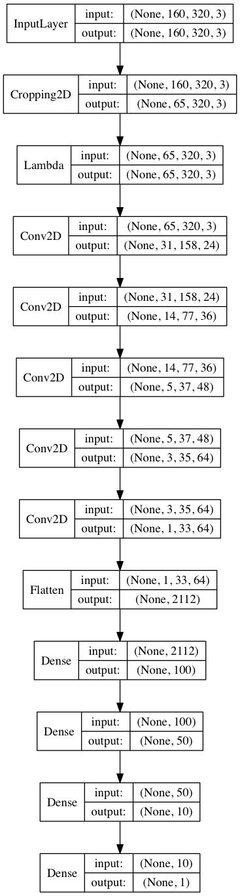
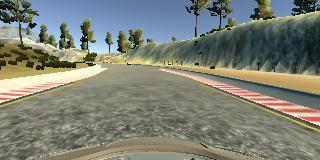
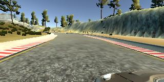
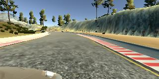
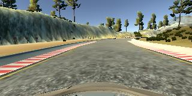

# **Behavioral Cloning** 

---

**Behavioral Cloning Project**

The goals / steps of this project are the following:

* Use the simulator to collect data of good driving behavior
* Build, a convolution neural network in Keras that predicts steering angles from images
* Train and validate the model with a training and validation set
* Test that the model successfully drives around track one without leaving the road
* Summarize the results with a written report

## Rubric Points
### Here I will consider the [rubric points](https://review.udacity.com/#!/rubrics/432/view) individually and describe how I addressed each point in my implementation.  

---
### Files Submitted & Code Quality

#### 1. Submission includes all required files and can be used to run the simulator in autonomous mode

My project includes the following files:

* [model.py](model.py) containing the script to create and train the model
* [drive.py](drive.py) for driving the car in autonomous mode
* [model.h5](model.h5) containing a trained convolution neural network 
* [writeup_report.md](writeup_report.md) summarizing the results

#### 2. Submission includes functional code

Using the Udacity provided simulator and my drive.py file, the car can be driven autonomously around the track by executing 

```sh
python drive.py model.h5
```

#### 3. Submission code is usable and readable

The model.py file contains the code for training and saving the convolution neural network. The file shows the pipeline I used for training and validating the model, and it contains comments to explain how the code works. I did not implement data generator as the virtual machine I used for training had enough memory.

### Model Architecture and Training Strategy

#### 1. An appropriate model architecture has been employed

My model is based on the model proposed by NVIDIA developers in the [End-to-End Deep Learning for Self-Driving Cars](https://devblogs.nvidia.com/deep-learning-self-driving-cars/) article.

For mode details about the model see the section `Final Model Architecture` below.

#### 2. Attempts to reduce overfitting in the model

In order to reduce overfitting I've collected data from both track 1 and 2.
In addition, I applied data augmentation by adding a horizontally flipped version of each frame. Having so various data set was enough to successfully train the model. 

I split the collected data into trained and validated sets (as 80% and 20% respectively). The model was trained and validated using the data sets to ensure that the model was not overfitting. The model was tested by running it through the simulator and ensuring that the vehicle could stay on the track 1 as well as on the track 2.

#### 3. Model parameter tuning

The model used an adam optimizer, so the learning rate was not tuned manually (model.py line 120).

#### 4. Appropriate training data

Training data was chosen to keep the vehicle driving on the road. I used center lane driving without any recovering driving. However, I used images from the left and right cameras to train the model to recover. For more details see the next section. 

### Architecture and Training Documentation

#### 1. Solution Design Approach

My first step was to ensure the overall pipeline (recording data, training a model using the data, and using the model to drive a car) is working.

I used the simplest neural network which consisted of one flatten layer and an output neuron. I recorded driving one lap on the track one, trained the NN, and made sure I'm able to run the simulator in autonomous mode.

Then I decided to use the LeNet-5 NN because I was already familiar with it and it showned pretty good results in the traffic sign classifier project.

In order to gauge how well the model was working, I split my image and steering angle data into a training and validation set. I did not face the overfitting problem, however the model did not work well: the car was'n able to pass the most curve parts of the track one, and it wasn't able to drive on the track two at all.

Next step I decided to try the CNN proposed by NVIDIA in the [End-to-End Deep Learning for Self-Driving Cars](https://devblogs.nvidia.com/deep-learning-self-driving-cars/) article. Using this CNN I acheived better performance (lower error) and it drove the car significantly better: it was able to keep the car within the track one as well as within the track two.

During training the models I ran the simulator to see how well the car was driving around track one and two. There were several issues which I solved by adding more training data. For more details see the section 3 below.

At the end of the process, the vehicle is able to drive autonomously around the tracks without leaving the road.

#### 2. Final Model Architecture

My final model is based on the model proposed by NVIDIA developers in the [End-to-End Deep Learning for Self-Driving Cars](https://devblogs.nvidia.com/deep-learning-self-driving-cars/) article.

The model consists of five convolutional layers followed by three fully-connected layers. Each layer is described in the table below:

|Layer | Output Shape | Configuration |
| ---  | ------------ | ------------- |
|Input           | 65x320x3  | Normalized input |
|Convolutional   | 31x158x24 | filters=24, kernel=5x5, strides=2x2 |
|Activation      | 31x158x24 | RELU |
|Convolutional   | 14x77x36  | filters=36, kernel=5x5, strides=2x2 |
|Activation      | 14x77x36  | RELU |
|Convolutional   | 5x37x48   | filters=48, kernel=5x5, strides=2x2 |
|Activation      | 5x37x48   | RELU |
|Convolutional   | 3x35x64   | filters=64, kernel=3x3, strides=1x1 |
|Activation      | 3x35x64   | RELU |
|Convolutional   | 1x33x64   | filters=64, kernel=3x3, strides=1x1 |
|Activation      | 1x33x64   | RELU |
|Flatten         | 2112      | |
|Fully connected | 100       | |
|Activation      | 100       | RELU |
|Fully connected | 50        | |
|Activation      | 50        | RELU |
|Fully connected | 10        | |
|Activation      | 10        | RELU |
|Output          | 1         | |

The network has 348219 parameters.

Here is a visualization of the architecture:



#### 3. Creation of the Training Set & Training Process

To capture good driving behavior, I first recorded four laps (two clockwise, and two counter-clockwise) on track one using center lane driving. Additionally, I captured driving through curve parts of the track one several times. Here is an example image of center lane driving:



I did not record the vehicle recovering from the left and right sides of the road back to center. Instead, I used images from the left and right cameras to train the model to recover. Here're example images taken by the left and right cameras.

 

Then I repeated this process on track two in order to get more data points.

To augment the data set, I also flipped images and angles thinking that this would help to combat overfitting and generalize the model. For example, here is an image that has then been flipped:



I used a keyboard for controlling the vehicle during capturing data on track one. This was good enough for the track on due to its simplicity. However this approach did not longer work for the track two. I had to use mouse to capture smooth steering, especially passing 180° turns.

After the collection process, I had 120834 data point. I then preprocessed this data by cropping each image (70 px from the top, and 25 px from the bottom), and normalizing it as `x = x / 255 - 0.5`.

I finally randomly shuffled the data set and put 20% of the data into a validation set. 

I used this training data for training the model. The validation set helped determine if the model was over or under fitting. The ideal number of epochs was 2 as evidenced by increasing the mean squared error during futher training. I used an adam optimizer so that manually training the learning rate wasn't necessary.

### Simulation

#### 1. The car is able to navigate correctly on test data

My final trained model is able to safely navigate the car on both track one and two. Here're example videos of the car driving on both tracks.

Camera view:

<a href="http://www.youtube.com/watch?feature=player_embedded&v=4jov2hf09AU
" target="_blank"></a> <a href="http://www.youtube.com/watch?feature=player_embedded&v=5J8KsJsH8aY
" target="_blank"></a>

The video files are also available in the `video` directory.

3rd-person view

<a href="http://www.youtube.com/watch?feature=player_embedded&v=7FWQ3BUwcyg
" target="_blank"></a> <a href="http://www.youtube.com/watch?feature=player_embedded&v=X4h_DA1XbwA
" target="_blank"></a>